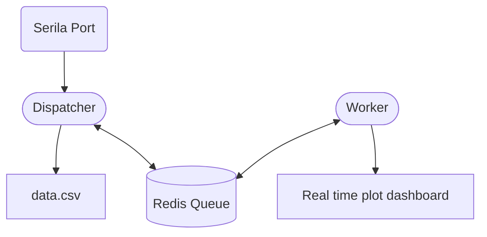

# MakiaSat Land Station Software 💻
This software makes it possible to save and display data, transmitted by CanSat, received from an antenna via the serial port in real time.

## Requirements

The following dependencies must be installed to use the code:
- [`Redis`](https://redis.io/docs/latest/operate/oss_and_stack/install/install-redis/)
- [`Pyrhon >= 3.11`](https://docs.anaconda.com/free/miniconda/miniconda-install/)

You can install all the python libraries you need using the command:
```
pip install -r requirements.txt
```

## Usage

First of all, it is neessary that redis is running
```
redis-server
```
To start the data collection program, simply run
```
python main.py
```
Open another shell to plot the data
```
python worker.py
```

## Documentation

### Redis
RedisClient is an object designed to establish a connection with a redis server and that provides methods for adding or removing items from a queue
```python
RedisClient(key: str, host: str, port: int)

  initial_del(self) -> None:
  push_list(self, element: list) -> Union[Awaitable[int], int]:
  pop_list(self) -> None or list:
  
```
- Clear redis queue on start
- Push element to queue
- Pop element from queue


```python
# Initialize client
r = RedisClient(host=REDIS_HOST, port=REDIS_PORT, key=REDIS_KEY)

# Delate previus data
r.initial_del()

# Push list to ram
r.push_list([1, 2, 3, 4])

# Pop list from ram
print(r.pop_list())

>>> [1, 2, 3, 4]
```
### Data Object

Data objects are designed to make data plotting simple; each object holds its data within itself and is responsible for plotting it

```python
DataObject(name: str, key: int, initial_value: float)
    update_data(self, new_data: list[float] = None) -> None:

PlottableDataObject(DataObject):
    update_graph(self, xdata: list) -> None:

MultiPlotDataObject(
                 ax: plt.axes,
                 name: str,
                 keys: list[int],
                 xlim: list[int],
                 ylim: list[int] = None,
                 delta: int = 0,
                 sources: list[str] = None,
                 initial_values: list[float] = None,
                 colors: list[str] = None
                ):
    update_y_limits():
    update_data(self, new_data: list[float] = None) -> None:
```
- Update data parsing redis data
- Update plot data
- Calculate viewport
  
```python
# Matplotlib figure    
fig = plt.figure()

# Create the axes
temp_axes = fig.add_subplot()

plt.ion()

# Create the plot
temp = MultiPlotDataObject(
  ax=temp_axes,
  colors=["red", "orange"],
  initial_values=[0, 0],
  keys=[5, 8],
  name="Temperature",
  sources=["Pressure", "Humidity"],
  xlim=view_section,
  ylim=[0, 20],
  delta=1
)

# Update the data
temp.update_data(new_data)

# Update graph with new data
temp.update_graph()
```

> [!WARNING]
> Sorry, documentation is planned ...

## How does it works ?

The dispatcher handles receiving the data its saving and adding it to a queue hosted on a redis database that is iterated by a worker that parses the data in order to display it in real time in an animated graph


